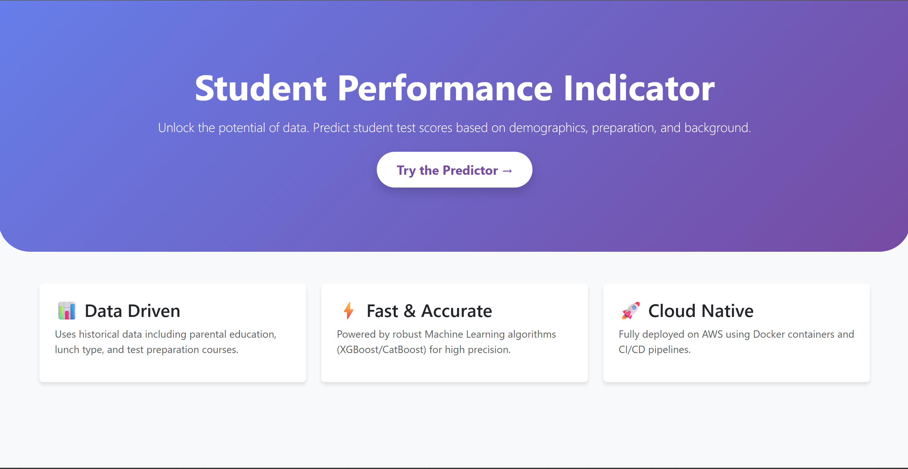
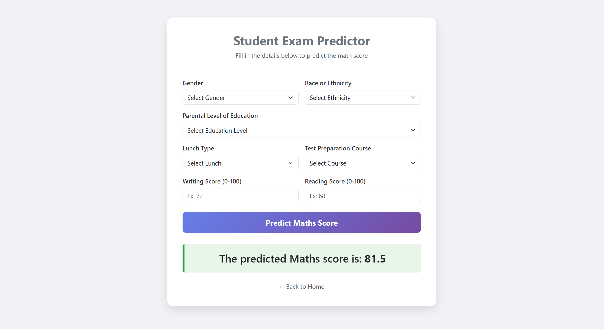

# 🚀 Student Performance Indicator - End-to-End ML Project


## 📝 Project Overview
This project is an end-to-end Machine Learning application that predicts a student's **Math Score** based on various demographic and academic factors. 

The goal was not just to build a model, but to implement a **production-grade MLOps pipeline**. The project handles data ingestion, transformation, model training, and deployment using industry-standard DevOps practices.

## 📸 Project Demo
<p align="center">
  
  <br><br>
  
</p>

---

## 🏗️ Architecture & Workflow
The project follows a modular coding structure and utilizes a robust CI/CD pipeline for deployment.

1.  **Data Ingestion:** Reading data from source and splitting into Train/Test.
2.  **Data Transformation:** Handling missing values, one-hot encoding, and standard scaling using a Preprocessing Pipeline.
3.  **Model Training:** Testing multiple algorithms (Random Forest, Decision Tree, XGBoost, CatBoost) and selecting the best performer based on R2 Score.
4.  **Deployment:** * The application is containerized using **Docker**.
    * **GitHub Actions** builds the image and pushes it to **AWS ECR**.
    * A Self-Hosted Runner on **AWS EC2** pulls the image and runs it live.


---

## 🛠️ Tech Stack
* **Programming Language:** Python
* **Web Framework:** Flask
* **Frontend:** HTML, CSS, Bootstrap 5
* **Machine Learning:** Scikit-Learn, CatBoost, XGBoost, Pandas, NumPy
* **Deployment:** AWS EC2, AWS ECR
* **Containerization:** Docker
* **CI/CD:** GitHub Actions

---

## 📂 Project Structure
```text
├── .github/workflows      # CI/CD Pipeline script (main.yaml)
├── artifacts/             # Generated model.pkl and preprocessor.pkl
├── notebooks/             # Jupyter notebooks for EDA and experimentation
├── screenshots/           # Images for README
├── src/
│   ├── components/        # Ingestion, Transformation, Trainer modules
│   ├── pipeline/          # Training and Prediction pipelines
│   ├── utils.py           # Helper functions (save/load objects)
│   ├── logger.py          # Custom logging configuration
│   └── exception.py       # Custom exception handling
├── templates/             # HTML files (index.html, home.html)
├── app.py                 # Flask entry point
├── Dockerfile             # Docker configuration
├── requirements.txt       # Dependencies
└── setup.py               # Package setup